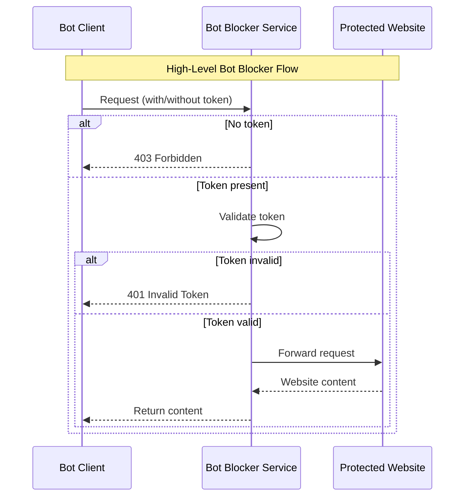

# Skyfire Solutions Crawler Bot Protection Proxy

A Node.js/Express proxy service with bot protection and identification.

## Features Overview

- **Bot Identification** - Identifies bot requests via `x-isbot: true` header, human requests bypass token verification
- **Kya Token Verification** - Validates `skyfire-pay-id` JWT tokens with signature verification and seller service association
- **Request Proxying** - Forwards valid requests to target website
- **Request Logging** - Logs all bot requests for monitoring and auditing

## Live Demo Link

You can play with the live demo [here](https://news-crawler-demo.skyfire.xyz/).

## 💳 How Proxy Charges Token

The proxy operates in a multi-step process to protect against unauthorized bot access while allowing legitimate traffic:



### Step 0: Bot Identification

- Checks for the `x-isbot: true` header to identify bot requests
- Human requests (without the header) bypass token verification and usage tracking
- Bot requests proceed to the next steps

### Step 1: Kya Token Verification

- Validates the `skyfire-pay-id` JWT token in the request header
- Verifies token signature, issuer, audience, and expiration
- Ensures the token is associated with the correct seller service
- Returns 401 Unauthorized for invalid or missing tokens

### Step 2: Usage Logging

- Logs all authenticated bot requests for audit and monitoring purposes
- Records request metadata including user agent, IP address, and timestamp

### Step 3: Request Proxying

- Forwards valid requests to the target website (configured via `PROXY_TARGET`)

## 📋 Prerequisites

1. Approved Seller Service with Seller Skyfire API Key
   In order to charge tokens, you will need to create a seller service and get it approved.
   Please follow the Skyfire Platform Setup Guide to create a seller account and seller service.

2. Docker Environment

## 🏠 Local Installation

### 1. Install Dependencies

```bash
   yarn install
```

### 2. Configure Environment

Copy .env.example to .env

```
# Configs
PORT=4000

# Proxy URL
PROXY_TARGET=<your_website> or use our mock news demo website https://mock-news-site.skyfire.xyz/

# API
SKYFIRE_API_URL="https://api.skyfire.xyz"

## Seller Service Information
JWT_ISSUER=https://app.skyfire.xyz
SELLER_SERVICE_AGENT_ID=<your_seller_agent_id>
SELLER_SERVICE_ID=<your_seller_service_id>
```

### 3. Start Services

```bash
docker-compose up
```

This starts the application with hot reloading enabled.

## 🧪 How to test request

Create a buyer token by create-token script.

```
yarn create-token <your_buyer_token_api_key>
```

If successful, this will create a JWT token and gives you the curl command that you can use right away

```
curl -IH "x-isbot: true" -H "skyfire-pay-id: <your_newly_created_JWT_token>" http://localhost:4000/
```
